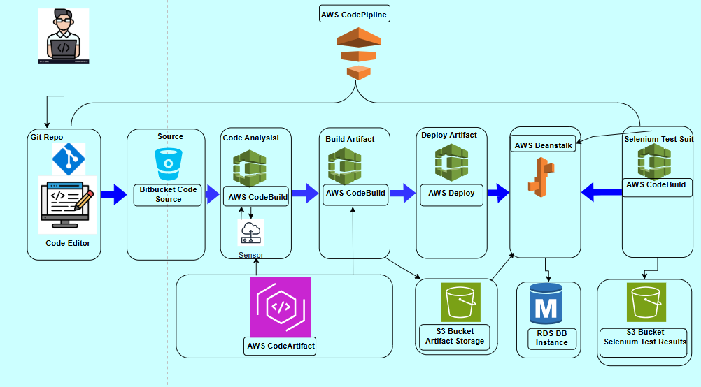

# Prerequisites
#
- JDK 11 
- Maven 3 
- MySQL 8

# Technologies 
- Spring MVC
- Spring Security
- Spring Data JPA
- Maven
- JSP
- Tomcat
- MySQL
- Memcached
- Rabbitmq
- ElasticSearch
# Database
Here,we used Mysql DB 
sql dump file:
- /src/main/resources/db_backup.sql
- db_backup.sql file is a mysql dump file.we have to import this dump to mysql db server
- > mysql -u <user_name> -p accounts < db_backup.sql
###########################################################################
  # Implementing a Full CI/CD Pipeline with AWS and Bitbucket

This project demonstrates the implementation of a **complete CI/CD pipeline** using **AWS services** integrated with **Bitbucket** as the source code repository.

## 🚀 Step-by-Step Process

### 1. Setup AWS Elastic Beanstalk (EB) Environment
Elastic Beanstalk is a Platform as a Service (PaaS) that helps deploy and manage applications in the cloud.  
We created an EB environment for hosting the application, which automatically handles:
- Environment provisioning  
- Load balancing  
- Scaling  
- Application health monitoring  

### 2. Setup Amazon RDS (Relational Database Service)
Provisioned an Amazon RDS instance (e.g., MySQL/PostgreSQL) to provide a **scalable and secure database** backend for the application.

### 3. Security Group & DB Initialization
- Created an **EC2 instance** to connect with the RDS instance.  
- Initialized RDS with necessary tables and configurations.  
- Updated the **RDS security group** to allow secure access on port **3306**.  

### 4. Update Code with pom.xml & settings.xml
- Updated `pom.xml` and `settings.xml` to define dependencies and secure repository access.  
- Integrated with **AWS CodeArtifact** for dependency management.  

### 5. Save RDS and SonarCloud Properties in AWS Systems Manager Parameter Store
- Stored sensitive data such as:
  - RDS connection strings  
  - SonarCloud credentials  
- Ensured secure retrieval by AWS services (e.g., CodeBuild).  

### 6. Code Analysis with SonarCloud
- Integrated **SonarCloud** for static code analysis.  
- Automated reports ensure code quality before proceeding to build.  

### 7. Build Job Setup with AWS CodeBuild and Store in S3
- Configured **AWS CodeBuild** to:  
  - Fetch code from **Bitbucket**  
  - Compile and build the application  
  - Store generated artifacts in **Amazon S3**  

### 8. Build Job and Deploy on Elastic Beanstalk
- Automated deployment of artifacts from S3 to **Elastic Beanstalk**.  
- Application hosted and managed in the EB environment.  

### 9. Software Testing Job Setup (Selenium Testing)
- Configured **Selenium testing** after deployment.  
- Automated browser testing to validate application functionality.  
- Test results stored in S3 for future analysis.  

### 10. CI/CD Pipeline Setup with AWS CodePipeline
- Orchestrated all steps using **AWS CodePipeline**:  
  - Source → Build → Test → Deploy  
- Enabled **fully automated application delivery** with quality checks.  

---

## 📂 Source Code
- [GitHub Repository](https://github.com/azizi-devops/CD-AWS)

---

## 🎯 Key Learnings
- AWS Elastic Beanstalk for PaaS deployments  
- Amazon RDS for database management  
- AWS CodeBuild + S3 for build automation  
- SonarCloud for code quality analysis  
- Selenium for automated testing  
- AWS CodePipeline for full CI/CD automation  
- Secure configuration management with AWS Parameter Store  

---
✨ This project highlights how to build a **scalable and automated CI/CD pipeline** with AWS and Bitbucket.
